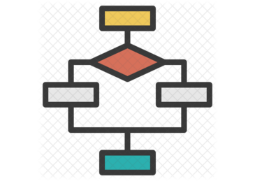

# Data Structures (DS)

   

In Computer Science a Data Structure (DS) is a way of organizing and store data in memory that enables efficient access and modification of the data.

There are many ways to organizing data in memory:

* Array
* Pointer
* Structure
* Linked List
* Stack
* Queue
* graph
* Searching
* Sorting

# Big O Analysis

# Algorithms
Step by step solution to solve a problem. As an example we can use list (data structure) to order vegetables and then select just what we need to prepare a vegetable salad.

In computer Science an algorithms is a sequence of actions to solve a problem. Small procedure to solves a recurrent problem.

# Notes
* Data Structures and Algorithm are two different things.