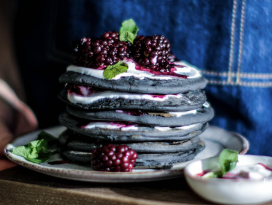

# Stack

Stack is an kind of Data Structure that serves as a collection of elements.

An real-life example is a stack of pancakes, the pancake that is in the top is the first one to be eaten and the bottommost position probabaly remains in the stack for more time. Adding or removing pancakes is only possibe at the top, also called as "LIFO" => "Last in first out"

The operation of "insertion" is called PUSH and the operation of "removal" is called "POP"
* **Push** : Add or storing an element on the top of a stack
* **Pop** : Removing an element from the top of a stack

There are other funcionalities to used  Stack efficiently:
* **Peek or Top**
* **isFull**
* **isEmpty**

# Queues